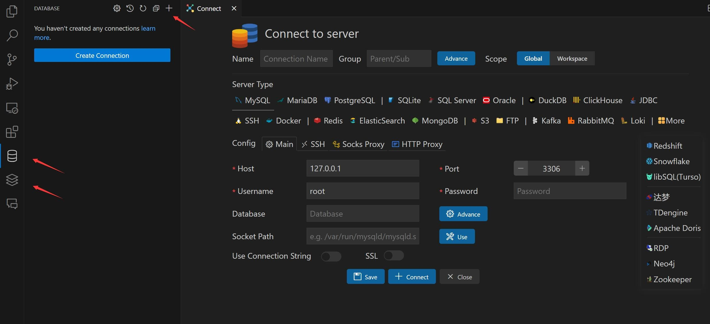

## Connect

1. Open Database Explorer panel, then click the `+` button.
2. Select your database type, input connection config then click the connect button.

Two panels are created because in some cases you need to view both SQL and NoSQL data at the same time, you can drag the panel to the other by long-pressing.

## Cache

In order to improve performance, the database information is cached. If your database structure changes externally, you need to click the refresh button to refresh the cache。

## Filter

Quickly filter tables, VSCode does not support creating input boxes, so this is the only way.

