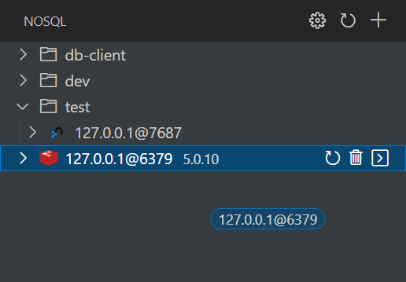

# Connection

## Cache

In order to improve performance, the database information is cached. If your database structure changes externally, you need to click the refresh button to refresh the cache。

## Grouping and sorting

When creating a connection, you can specify a group for the connection.

After creation, the grouping or order of connections can be modified by dragging in the tree panel.

## Requirements

### Docker

**When do you need this extension**?

Microsoft provides an extension for Docker, but it can only connect to the local docker. When you need to manage Docker on multiple servers, it is powerless. At this time, this extension can help you do it.

**Steps**:

Docker provides a management http interface, it is disabled by default, you need to manually enable it.

1. Edit docker service: `vim /usr/lib/systemd/system/docker.service`, Find ExecStart, add -H `tcp://127.0.0.1:2375 --tls=false` at the end of the line
2. Restart docker: `systemctl daemon-reload && systemctl restart docker`

For remote dockers, you should always connect via ssh tunnel to be safe.

### SQL Server

If you want to connect to your local SQL Server through a port, you usually need to enable the TCP/IP connection method. For details, see:

[Configure a Server to Listen on a Specific TCP Port - SQL Server | Microsoft Docs](https://docs.microsoft.com/en-us/sql/database-engine/configure-windows/configure-a-server-to-listen-on-a-specific-tcp-port?view=sql-server-ver15#SSMSProcedure)

### SQLite

1. SQLite relies on SQLite external programs to connect, if your operating system is not windows, you need to make sure you have sqlite3 in your environment variables.
2. If you get the error "unknown command or invalid arguments: "open"." when using sqlite, please consider downgrading your sqlite3 version, in some sqlite3 versions the .open command is removed, but the extension requires the open command to support unicode character.

### MongoDB

MongoDB has less support and no longer actively maintained, only recommended for browsing data.

## Object Filter

Quickly filter database objects, or by clicking the filter button to the right of the tables.

