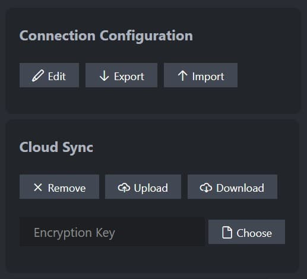

# Util

## Notebook

You can create a SQL notebook by creating a new file with the suffix of sqlbook, which is used to archive the SQL of multiple connections.

## Table Definition

You can display table definition SQL in the following ways:

1. When moving the mouse over the table
2. Using "go to definition": by ctrl+mouse click

Note: Only non-hidden tables can be displayed, and only available to premium users

## Console

By clicking this button to open the console, where you can modify extension settings, export and import config.

### Options

There are two types of settings provided here, advanced settings are only available to paid users.

### Cloud Sync

To synchronize your connection information through the cloud.

You can specify an encryption key, which will be used for DES encryption and decryption during synchronization to ensure your data security.

## Mock Data

Quickly generate data for database testing, generate by following steps:

Generate Config

- mockStartIndex: Used to populate the primary key, auto means to take the total number of current table data + 1.
- mockCount: The total number of test data you want to generate
