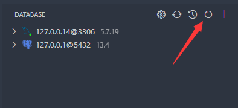
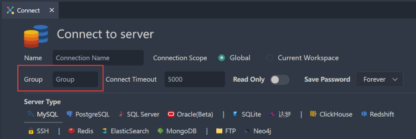

# 备注

## 缓存

为了提高性能，缓存了数据库信息，如果你的数据库结构在外部发生了变更，需要点击以下按钮刷新缓存。

## 分组和排序

在创建连接时, 可以为连接指定一个分组

创建后, 可在树形面板通过拖动修改连接的分组或者顺序

## 先决条件

### Docker

**什么时候你需要这个扩展**?

尽管微软提供了Docker的扩展程序, 但只能连接到本机的docker, 当你需要管理多台服务器上的Docker时, 它无能为力, 这个时候这个扩展可以帮助你做到.

**使用步骤**:

Docker提供了HTTP管理接口, 默认情况下是禁用的, 你需要手动操作开启它.

1. 编辑Docker服务: `vim /usr/lib/systemd/system/docker.service`, Find ExecStart, add -H `tcp://127.0.0.1:2375 --tls=false` at the end of the line
2. 重启Docker: `systemctl daemon-reload && systemctl restart docker`

对于远程的docker, 你应该始终通过ssh隧道连接来保证安全.

### SQL Server

如果要通过端口连接到你本机的SQL Server, 通常需要启用TCP/IP连接方式, 详情查看:

[Configure a Server to Listen on a Specific TCP Port - SQL Server | Microsoft Docs](https://docs.microsoft.com/en-us/sql/database-engine/configure-windows/configure-a-server-to-listen-on-a-specific-tcp-port?view=sql-server-ver15#SSMSProcedure)

### SQLite

1. SQLite依靠SQLite外部程序来连接, 如果你的操作系统不是windows, 需要确保你的环境变量中具有sqlite3.
2. 如果你使用sqlite出现错误"unknown command or invalid arguments: "open".", 请考虑降级你的sqlite3版本, 在某些sqlite3版本中.open命令被移除了, 但扩展需要通过open命令才能支持unicode字符.

### MongoDB

MongoDB只有少量的支持, 且不再积极维护, 只推荐用于浏览数据.

## 对象筛选

快速筛选数据库对象, 或者通过点击tables右侧的过滤按钮筛选.

